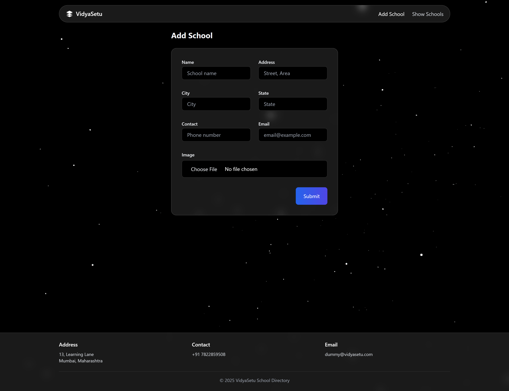
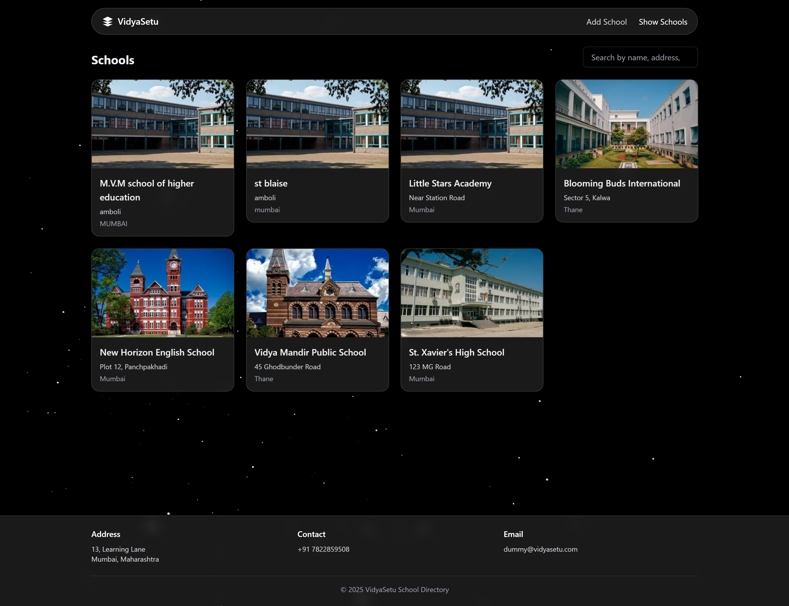
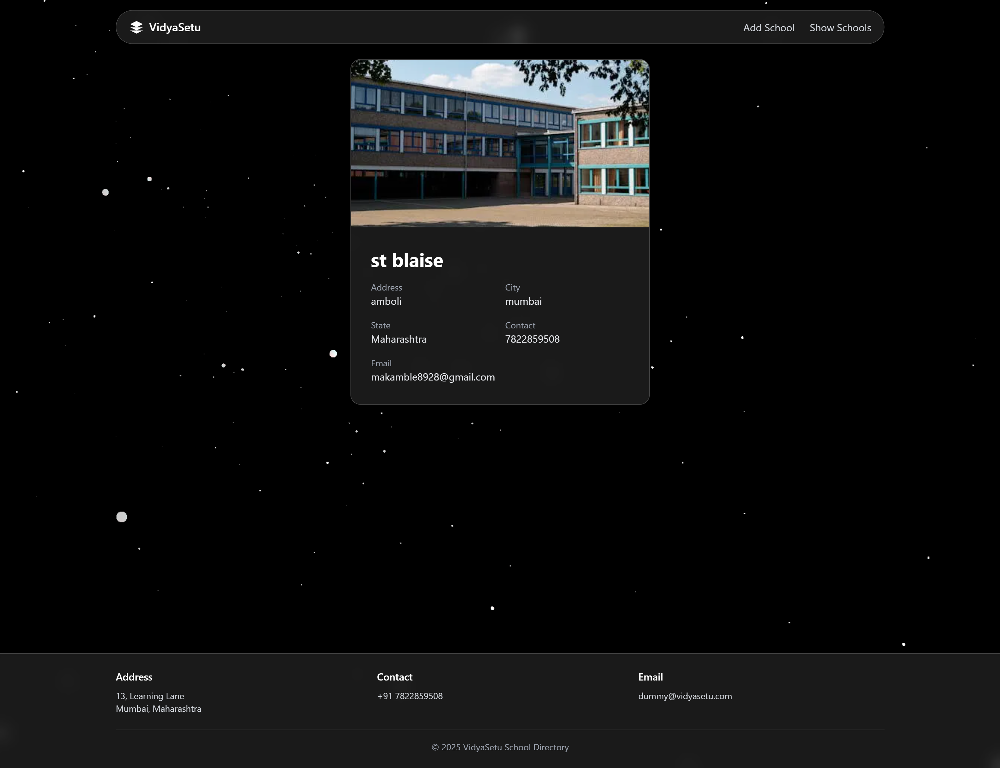
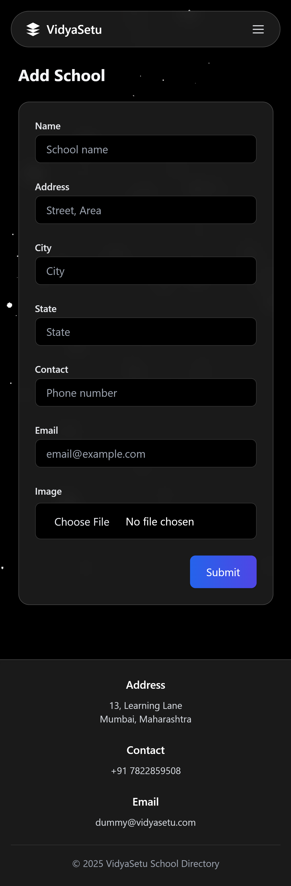
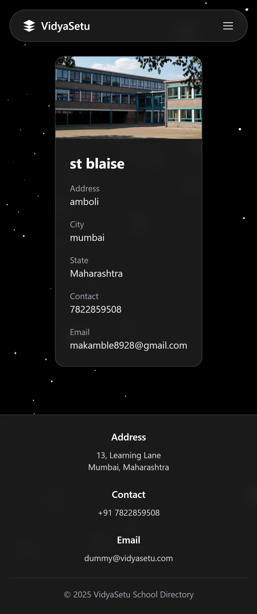

# VidyaSetu

A polished Next.js + Tailwind + MySQL school directory with local image uploads, glassmorphism UI, and particle background.

## Features
- Mobile-friendly navbar with glass dropdown and blurred overlay
- Add School form with client/server validation, unique email & phone check, toasts, and image preview
- Show Schools with search and Load More pagination
- School details page (`/school/[id]`) with full info and optimized image
- Loading spinners for fetching and submitting
- Auto-created MySQL database and `schools` table on first run
- Local image storage under `public/schoolImages/`
- Dummy school data is auto-inserted only if the table is empty

## Validations
- Name: Required, text only
- Address: Required
- City: Required
- State: Required
- Contact: Required, digits only, unique (10 digits for Indian numbers)
- Email: Required, valid email format, unique
- Image: Required, file upload stored locally

## Tech Stack
- Next.js 14, React 18
- Tailwind CSS
- Framer Motion
- React Hook Form
- mysql2 (Promise pool)
- react-hot-toast

## Installation & Running Locally
1) Create `.env.local` in project root (example):
   DB_HOST=localhost  
   DB_USER=root  
   DB_PASSWORD=yourpassword  
   DB_NAME=schooldb  

2) Install dependencies:
   npm install

3) Start the dev server:
   npm run dev

## Database Auto-Creation
On first request to the API, the app will:
- Create the database `schooldb` if missing
- Create the `schools` table if missing
- Ensure `public/schoolImages/` exists for uploads
- Insert dummy school data (with real images) only if the table is empty

## Vercel Deployment (Important)
- This project uses a local MySQL database and local image storage, as required in the assignment.  
- These features do not work on Vercel because:
  - Vercel is a stateless serverless host (no persistent MySQL or filesystem)
  - Local image uploads and DB operations are not supported  
- Therefore:
  - The app may deploy on Vercel but show errors or empty data  
  - To see full functionality, run locally with MySQL using the steps above  

## Screenshots

### Desktop View

- **Add School Form**  
  

- **Show Schools Page**  
  

- **School Details Page**  
  

### Mobile View

- **Add School Form**  
  

- **Show Schools Page**  
  

- **School Details Page**  
  

## Project Structure
- components/: UI components like Navbar, Footer, SchoolCard, Spinner, FormInput
- lib/: db.js (pool + ensure schema), fileUpload.js (local image saving)
- pages/: Next.js pages and API routes
  - addSchool.jsx, showSchools.jsx, school/[id].jsx
  - api/schools/index.js, api/schools/[id].js
- public/schoolImages/: Uploaded images
- styles/: Tailwind globals

## Notes
- Local images won’t persist on stateless hosts; use persistent storage in production.
- Server routes validate email and Indian mobile format; used react-hook-form.
- Dummy schools are safe sample data with Pexels images.
- For evaluators: please run locally to see complete working functionality.
